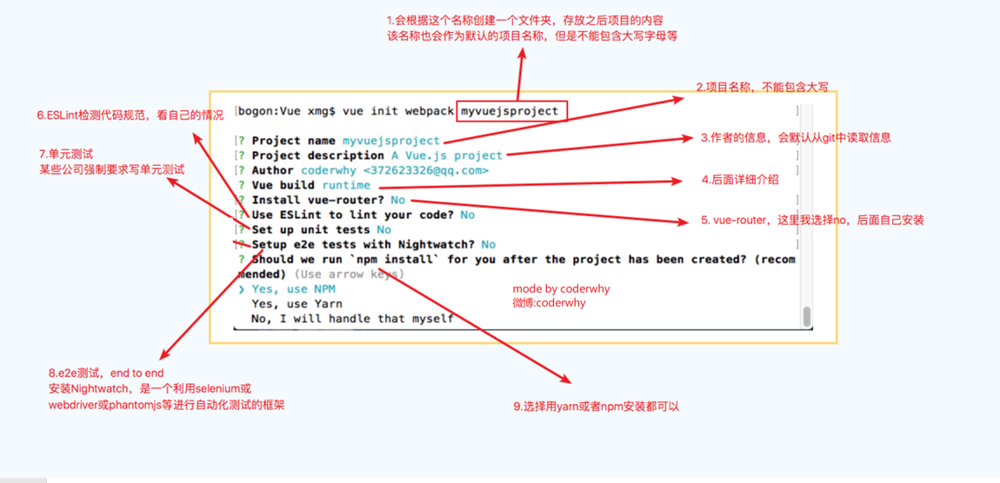
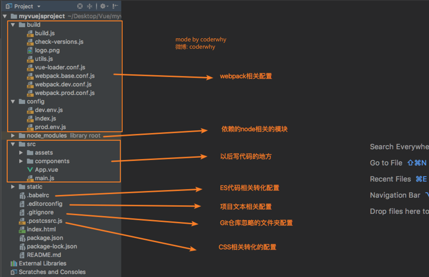
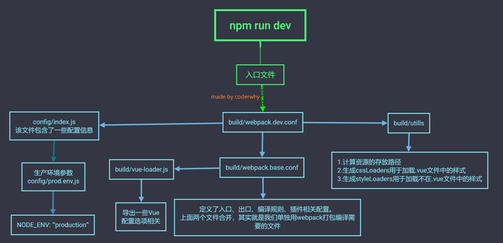
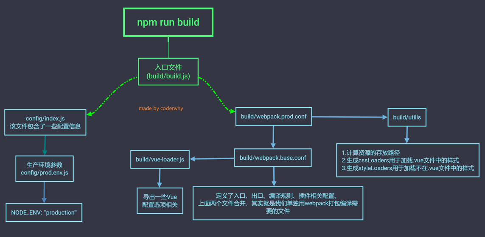
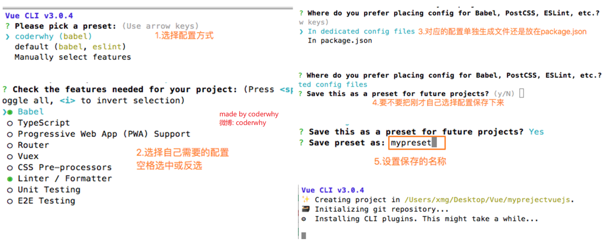
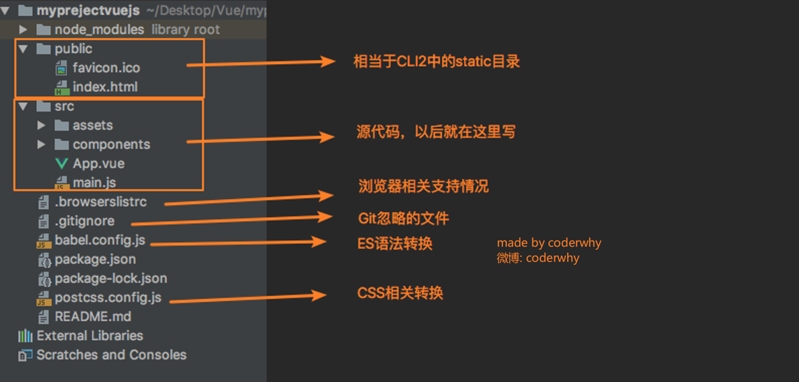

## Vue CLI的使用

### 安装Vue脚手架

```js
//默认安装最新版本
npm install -g @vue/cli
//或者一起安装脚手架全局服务器
npm install -g @vue/cli @vue/cli-service-global
```

注意：我这里安装的是Vue CLI 4.1.2的版本  
如果需要按照Vue CLI2的初始化项目需要拉取2.x模板。

```js
npm install -g @vue/cli-init
```

* **Vue CLI2初始化项目**  

		`vue init webpack my-project`  
	

**Vue CLI2初始化项目流程图:**  



**课外知识：**  

* node由C++开发，V8引擎做支撑。所以使用node可以直接运行js代码，而不是通过浏览器
* 假如我用了ESlint，但后来不想用了，可以在config文件夹中index.js，找到useESlint设为false，然后重新编译即可。

**目录结构:**


补充：cli2中static文件夹原封不动进行打包。cli3中public替换static，并把index.html文件移到pulick中

**npm run dev流程图**



**npm run build流程图**


### Runtime-Compiler和Runtime-only的区别

#### Vue程序运行过程

> template -> ast(抽象语法树) -> render -> virtual dom(虚拟dom) -> ul(真实页面)

components运行的就是template -> ast过程，而render函数不需要这个过程  

**为什么不需要这个过程：** 因为我们配置.vue文件封装处理时安装过vue-template-compiler，
由它把template解析成js对象进行render渲染。所以最终生成的bundle中不需要compiler编译

**区别：**

1. 所以Runtime-only函数性能更高，
2. Runtime-only代码量更少

<br>

#### render函数的使用

解析render: h => h(App)  
render函数中回调过来的h就是vue中的createElement

1. 普通用法  
//createElement('标签'，{标签的属性},['内容'])
		
	
	```js
	render:function (createElement) {
		//基本使用
		return createElement('h2',{class:'box'},['hello vue'])
		//嵌套用法
		return createElement('h2',{class:'box'},['hello vue',createElement('button',['按钮'])])
	}
	```
2. 传入组件对象

		render:function (createElement) {
			return createElement(cpn)
		}
所以render: h => h(App) 传入的是组件对象  

**总结：**  

* 如果在之后的开发中，你依然使用template，就需要选择Runtime-Compiler  
* 如果你之后的开发中，使用的是.vue文件夹开发，那么可以选择Runtime-only。  _ps:我们一般用runtime-only_

### Vue CLI3/4

**Vue CLI3/4初始化项目**  
`vue create my-project`

**Vue CLI3/4初始化项目流程图:** 



**目录结构**



**注意：**  
* $mount('#app')等同于el:'#app'

#### 配置文件打开方式

cli3的配置 文件打开方式  

一、图形化管理界面  

	启动配置服务器  vue ui
		
	1. cd进当前目录，运行vue ui
	2. 进入vue项目管理器导入当前文件夹
	3. 在依赖选项中搜索依赖进行安装

二、本地文件查找  

进入node-modules/cli-serviver/lib/config文件夹，一般不通过这种方式

三、创建文件方式

	1. 创建一个vue.config.js
	2.在文件中导出配置 module.exports={}
	3.记得在头部require()插件

### 配置别名

在开发中我们需要引用文件时需要一层层查找，非常浪费时间，我们可以通过配置别名的方式，直接引用某个目录。如之前使用../../pages/index  配置别名后直接使用pages/index即可


在webpack.config中alias里设置别名，  
如果是CLI3/4则在vue.config.js中配置   

```js
const path = require('path')
function resolve(dir){
  return path.join(__dirname,dir)
}

module.exports ={
  //配置方式一：
    
  // resolve : {
  //   alias : {
  //     'views': '@/views',
  //     'components': '@/components',
  //     'network': '@/network',
  //     'common': '@/common',
  //     'assets': '@/assets',
  //   }
  // },
    
  //配置方式二：  ps：前面的导入path和函数resolve别忘记写
  chainWebpack: (config) =>{
    config.resolve.alias
        .set('views',resolve('src/views'))
        .set('components',resolve('src/components'))
        .set('network',resolve('src/network'))
        .set('common',resolve('src/common'))
        .set('assets',resolve('src/assets'))
  }
}
```

**注意：配置成功后，如使用src导入前面图片或资源，需加波浪符号~**。

如`src/img/a.jpg` 需写成`~img/a.jpg`


**踩坑记录：**  

* 配置方式1不行试试配置方式2

* 编译失败重启编译器

* 实在不行。
	
	内部已设置好@=src，直接用@/views这种方式，获取src下面的目录。  
	
	但这种方式不支持import导入文件，支持 `src='@/views/xxx.jpg'`的导入