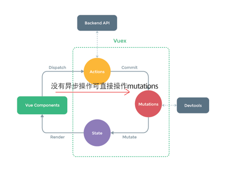

## VueX状态管理

Vuex 是一个专为 Vue.js 应用程序开发的状态管理模式。  

它采用 **集中式存储管理** 应用的所有组件的状态，并以相应的规则保证状态以一种可预测的方式发生变化。  

Vuex 也集成到 Vue 的官方调试工具 devtools extension，提供了诸如零配置的 time-travel 调试、状态快照导入导出等高级调试功能。

> 简而言之：Vuex可在多个组件中共享状态，并且是一个 响应式 / 统一 / 状态管理 工具

<br>

### 安装和使用vuex

1. 安装vue-vuex，也可以通过脚手架安装  

		npm install vuex --save
2. 配置store文件  
	1. 新建store文件夹index.js文件，导入Vue和Vuex，并且安装 Vue.use(Vuex)
	
	2. 创建Vuex.Store，配置其状态/变动/异步等
	
	3. 导出store，并在main.js中导入，挂载。
			
		```js
		//当挂载时，内部其实在执行如下操作
			Vue.prototype.$store = store
		```

<br>

<a name='a'></a>

### Vuex状态管理图


	
<br>

### Store的配置

```js
option:[
	state:{//状态属性，又叫单一状态树},
	mutations:{//变动，类似方法，用来修改state},
	actions:{//异步操作},
	getters:{//类似计算属性},
	modules:{//划分模块}
]
```

<br>
	

### state状态获取

state设置  

```js
state:{
	counter:0
}
```

获取state属性  

```html
<div>$store.state.counter</div>
```

**注：在js中使用记得加this**

<br>
	

### state状态改变

通过<a href='#a'>状态管理图</a>可以看到，我们不建议直接修改$stort.state。
因为直接修改Vuex便追踪不到其状态的变化

> Vuex的store状态的更新唯一方式：提交Mutation

### mutations主要包括：

* 字符串的事件类型（type）//也就是函数名
* 一个回调函数（handler）,该回调函数的第一个参数就是state。//函数名后面的函数

注意： mutations中的每个方法尽可能完成的事件单一一点。意思是尽量只做一件事。  
actions中一般放异步操作，但如果有逻辑的操作，也可以放在actions中。
#### mutations改变状态方法

1. 在组件中设置如点击事件，提交要运行的变动
	```js
	methods:{
	  addCounter(){
	    this.$store.commit('add')
	  }
	}
	```
	
2. 在vuex配置mutations中，设置变动方法  
	```js
	mutations:{
	  add(state){
	    state.counter++   
	    //或者不传参数，直接使用this.state.counter++   
	  }
	}
	```

<a name='c'></a>
		
#### mutations传参技巧	

3. 往mutations中额外传递参数，我们称之为**负载payload**
	1. 在组件中调用方法传入参数
		```js
		methods:{
		  changeCounter(count){
				//也可以传入对象，如const count = {num:0}
				this.$store.commit('changeNum',count)
			}
		}
		```
		
	2. 在mutations中传入即可
	
	    ```js
	    mutations:{
	      changeNum(state,count){
	    		state.counter += count
	    	}
	    }
	    ```
	
	    

#### mutations提交风格

4. 除了普通的提交方式，我们还可以以对象的方式commit
	1. 把类型和参数作为payload一起传递
			
		```js
		methods:{
		  changeCounter(count){
				// this.$store.commit('changeNum',count)
				this.$store.commit({
				  type:'changeNum',
				  count
				})
			}
		}
		```
		
		
		
	2. 在mutations中传入载荷并使用其属性即可
	
	    ```js
	    mutations:{
	      changeNum(state,payload){
	    		// state.counter += count
	    		state.counter += payload.count
	    	}
	    }
	    ```
	
	    

#### mutations响应风格

当属性在state中初始化时，这些属性都会被加入到响应式系统中  
响应式系统会监听属性变化，当属性发生变化会通知用到属性的界面发生刷新

响应式规则：  
1. 提前在store中初始化所需属性
2. 使用vue.set() 或Vue.delete() 做到响应式添加或删除属性
3. 数组响应式方法看Vue基础学习笔记，或自行搜索

#### mutations常量

在mutation中, 我们定义了很多事件类型(也就是commit的方法名称).  
当项目增大时，要管理的状态越来越多，有可能出现方法名称写错等情况  

方法：  
1. 创建一个文件: mutation-types.js, 并且在其中定义我们的常量.
		const ADD = 'add'
	
2. 在需要用到的地方import * as全部导出

3. 在commit时正常使用，但使用mutations时作为函数名需要加一个中括号

		```js
	//commit正常用
		this.$store.commit(typeName.ADD)
	
		//作为函数名使用需加中括号
		[typeName.ADD](){
			this.state.counter++
		}
	```
	
	```
#### mutations同步函数

通常情况下, Vuex要求我们Mutations中的方法必须是同步方法.
如果是异步操作, devtools无法记录这个操作以便调试

如果确实需要异步操作，使用actions

<br>
	

### actions异步操作

> Actions类似于Mutations, 但是是用来代替Mutation进行异步操作的.

#### actions传值

Actions传递的是上下文context，**和store对象**具有相同的方法和属性

#### actions分发

在<a href='#a'>Vuex状态图</a>中看到，当有异步操作时我们要从
1. vue组件分发到actions，
2. 从actions提交到mutations，
3. 再由mutations改变state

所以在Vue组件中, 如果我们调用action中的方法, 那么就需要使用分发**dispatch**

同样actions也支持传递payload

代码示例：  

```js
1.  vue组件分发到actions
    	methods:{
    	  changeInfo(){
    		this.$store.dispatch('actionInfo','payload')
    	  }
    	}
2.  从actions提交到mutations
     actions:{
       /**
       	* 方法一：
       	*/
        actionInfo({commit},payload){
          setTimeout(()=>{
            commit('mutationInfo',payload)
          },1000)
        }
       /**
       	* 方法二：
       	*/
        // actionInfo(context,payload){
        //   setTimeout(()=>{
        //     context.commit('mutationInfo',payload)
        //   },1000)
        // }
    	}
3.  再由mutations改变state
     mutationInfo(state,payload){
    	  state.info.name = 'vicer'
    	  console.log(payload);
     }
```

<a name='d'></a>
	

#### actions返回promise

我们都知道es6中promise常用于异步操作  
在Action中, 我们可以将异步操作放在一个Promise中, 并且在成功或者失败后, 
调用对应的resolve或reject.  

```javascript
	actions:{
      actionInfo(context,payload){
        return new Promise((resolve, reject) => {
          setTimeout(()=>{
            context.commit('mutationInfo',payload)
            resolve()
          },1000)
        }).then(() => { 
          console.log('信息更新成功');
        })
		//利用promise的回调机制，这里的then除了再自身调用。
		//也可以在，调用actions方法的后面使用，
		//如this.$store.dispatch('actionInfo',data).then()
      }
    },
```

#### mapActions辅助函数

mapActions可以把store中的actions映射到局部计算属性中。  

使用方法和mapGetters一样

1. 导入mapActions、
		`import {mapActions} from 'vuex'`
2. 在methods中使用
	1. 数组方法
			`...mapActions(['gettersName1','gettersName2'])`
	2. 对象方法，可自定义名字
			`...mapActions({gn1:'gettersName1',gn2:'gettersName2'})`


#### actions返回的promise与mapActions的配合

当使用mapActions时，可把**actions的方法名**传递过来进行调用，来代替this.$store.dispatch

1. 导入并在methods中使用mapActions
	```js
	import {mapActions} from 'vuex'
	
	methods:{
	  ...mapActions(['actionInfo'])
	}
	```
	
	
	
2. 替代$store中dispatch到actions的方法

    ```js
    //原来的方法
    //this.$store.dispatch('actionInfo',data).then()
    
    //现在的方法
    this.actionInfo(data).then()
    ```


### getters参数和传递参数

> 前面已经说过，getters使用类似计算属性，我们还可以传它已经设定好的参数

#### getters固定参数

1. 传已经设定好的状态state
		
	```js
	getPerson(state){
	  //过滤函数filter，返回大于18岁
	  return state.persons.filter(n => n.age>18);
	}
	```
	
	
	
2. 既然getters类似计算属性，我们也可以把计算属性作为参数传进去
	
	```js
	getLength(state,getters){
	  //返回length
	  return getters.getPerson.length;
	}
	```
	
	

<a name='b'></a>

#### getters传参技巧

3. 我希望自己传入参数，比如我自己设置年龄并传入getters中返回

	```js
	//正常思路是想办法把参数传进getters中，但它只能传state和getters设定好的属性
	//解决方案是返回一个函数,利用函数来传值
		getCustomize(state){
			return function (nowage) {
			  return state.persons.filter(n => n.age>nowage);
			}
		}
		//使用
		$store.getters.arrCustomize(12)
	```

<br>

#### mapGetters辅助函数

mapGetters可以把store中的getters映射到局部计算属性中。  
免去了要从计算属性导入getters的麻烦

**正常使用：**

```html
<div>
	{{getName1}}  
  {{getName2}}
</div>

//js
computed:{
	getName1(){
		return this.$store.state.gettersName1;
	},
  getName2(){
		return this.$store.state.gettersName1;
	},
}
```


**使用方法：**

1. 导入mapGetters、
		`import {mapGetters} from 'vuex'`
2. 在computed中使用
	1. 数组方法
		
		```html
		<div>
			{{gettersName1}}  
		  {{gettersName2}}
		</div>
		
		//js
		
		computed:{
		...mapGetters(['gettersName1','gettersName2'])
		}
		
		```
		
	2. 对象方法，可自定义名字
		
		```js
		computed:{
			...mapGetters({gn1:'gettersName1',gn2:'gettersName2'})
		}
		```
		
		


### modules模块

Vue使用单一状态树,那么也意味着很多状态都会交给Vuex来管理.  
当应用变得非常复杂时,store对象就有可能变得相当臃肿.  
为了解决这个问题, Vuex允许我们将store分割成模块(Modules), 
而**每个模块拥有自己的state、mutations、actions、getters等**

```js
let moduleA = {
  state:{
    name:'test',
    age:18
  },
  mutations:{
    // ...
  },
  actions:{
    // ...
  }
}

const store = new Vuex.Store({
    state,
    mutations,
    actions,
    getters,
    modules:{
      a:moduleA
    }
})
```


#### 获取模块中state

在Vuex中我们只是将state分割成了模块，但其实还是被放在rootState中的，  
所以当我们需要获取，模块a下面的state的name时  

`$store.state.a.name`

**注意：**  
* 模块中的mutations、actions、getters使用和调用方法不变

* 使用模块中的actions时，只能提交模块中的mutations。

* actions中的context保存了一些本地及根属性，可在传入时打印context查看

* 如果想在模块中使用stote中的state，只需多传一个参数rootState即可  
	（此参数只在模块中的getters有效）
	
	```js
	  getters:{
	    fullName(state){
	      return state.name + 111
	    },
	    fullName1(state,getters,rootState){
	      return  state.name + rootState.counter
	    }
	  }
	```
	
#### 命名空间

在大型项目中会有多个模块，当多个模块时可能会出现命名冲突的问题，这时我们就可以使用命名空间来解决这个问题

**配置方法：**

```js
// moduleA.js
cosnt store = {
  //...
}
const mutations = {
  setModuleA(){
    //...
  }
}
//在导出模块的时候配置参数namespaced
export default { namespaced:true, store , mutations}
```

**使用方法：**

```js
this.$store.commit('moduleA/setModuleA')   
```


### 项目结构

在store中，
1. 我们会把state在当前页面抽离成一个单独对象引用。
2. mutations，actions，getters则抽离成一个文件引用
3. modules则抽离成一个单独的文件夹，文件夹中放被抽离的modules

### 函数思想高级使用技巧

笔记必看，链接走起  
> 注意对比getters与mutations传参方式的区别
>
> * <a href='#b'>getters传参技巧第3点</a>  
* <a href='#c'>mutations传参技巧第3点</a>
* <a href='#d'>actions返回promise</a>
